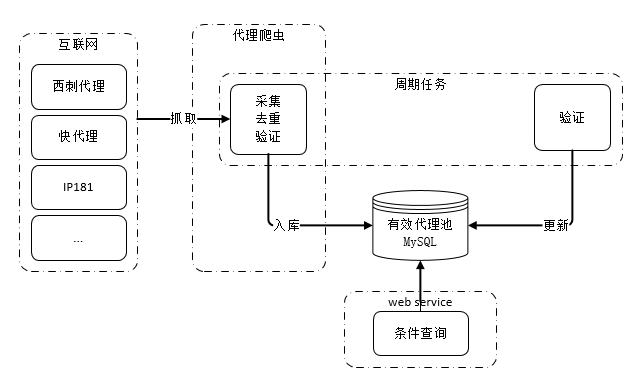

# Golang实现的IP代理池

> 采集免费的代理资源为爬虫提供有效的IP代理

## 系统功能

- 自动爬取互联网上公开的免费代理IP
- 周期性验证代理IP有效性
- 提供http接口获取可用IP

## 系统架构



## 代理池设计

代理池由四部分组成：

- Fetcher：

代理获取接口，目前有几个 **免费代理源** ，每调用一次就会抓取这些网站最新的代理放入Channel，可自行 **添加额外的代理获取接口** 

- Channel：

临时存放采集来的代理，通过访问稳定的网站去验证代理的有效性，有效则存入数据库

- Schedule：

用定时的计划任务去检测数据库中代理IP的可用性，删除不可用的代理。同时也会主动通过 Fetcher 去获取最新代理

- Api：

代理池的访问接口，提供 `get` 接口输出 `JSON` ，方便爬虫直接使用

## 目前支持的代理

代理获取接口，目前抓取这几个网站的 **免费代理** ，当然也支持自己扩展代理接口；

- [89免费代理](https://www.89ip.cn)
- [~~66免费代理网~~](http://www.66ip.cn)
- [云代理](http://www.ip3366.net)
- [快代理](http://www.kuaidaili.com)
- [~~Proxylist+~~](https://list.proxylistplus.com)
- [openproxylist](https://openproxylist.com/)
- [Geonode](https://geonode.com/)
- [TheSpeedX](https://github.com/TheSpeedX/PROXY-List) 
- [hideip.me](https://github.com/zloi-user/hideip.me) 
- [Free Proxy List](https://github.com/proxifly/free-proxy-list) 
- [fresh-proxy-list](https://github.com/vakhov/fresh-proxy-list) 
- [yemixzy/proxy-list](https://github.com/yemixzy/proxy-list) 
- [Zaeem20](https://github.com/Zaeem20/FREE_PROXIES_LIST) 
- [Anonym0usWork1221](https://github.com/Anonym0usWork1221/Free-Proxies)
- [zenjahid](https://github.com/zenjahid/FreeProxy4u) 
- [ProxyScraper](https://github.com/ProxyScraper/ProxyScraper) 
  

## 安装及使用

### 源码安装

```shell
# 克隆项目
git clone https://github.com/wuchunfu/IpProxyPool.git

# 切换项目目录
cd IpProxyPool

# 修改数据库信息
vi conf/config.yaml

host: 127.0.0.1
dbName: IpProxyPool
username: IpProxyPool
password: IpProxyPool


# 安装go依赖包
go list (go mod tidy)

# 编译
go build main.go

# 赋予可执行权限
chmod +x IpProxyPool

# 运行
./IpProxyPool -f conf/config.yaml
```

### Docker 安装

> `Docker` 请自行安装，安装完 `docker` 后查看是否安装 `docker-compose`
> 执行这个命令查看是否成功安装 `docker-compose`, `docker-compose -version`

```shell
# 克隆项目
git clone https://github.com/wuchunfu/IpProxyPool.git

# 进入项目目录
cd IpProxyPool

# 修改MySQL配置 
vi conf/config.yaml
# mysql
database:
  host: proxypool_mysql
  port: 3306
  dbName: IpProxyPool
  username: root
  password: 'P@ssw0rd'


# proxypool镜像构建
docker build -t proxypool:latest .

# 执行以下命令启动
docker-compose -f docker-compose.yaml up -d

# 执行以下命令停止
docker-compose -f docker-compose.yaml down
```

## 访问

```shell
# web 访问
http://127.0.0.1:3000

# or
# 随机输出可用的代理
curl http://127.0.0.1:3000/all

# 随机输出HTTP代理
curl http://127.0.0.1:3000/http

# 随机输出HTTPS代理
curl http://127.0.0.1:3000/https
```

